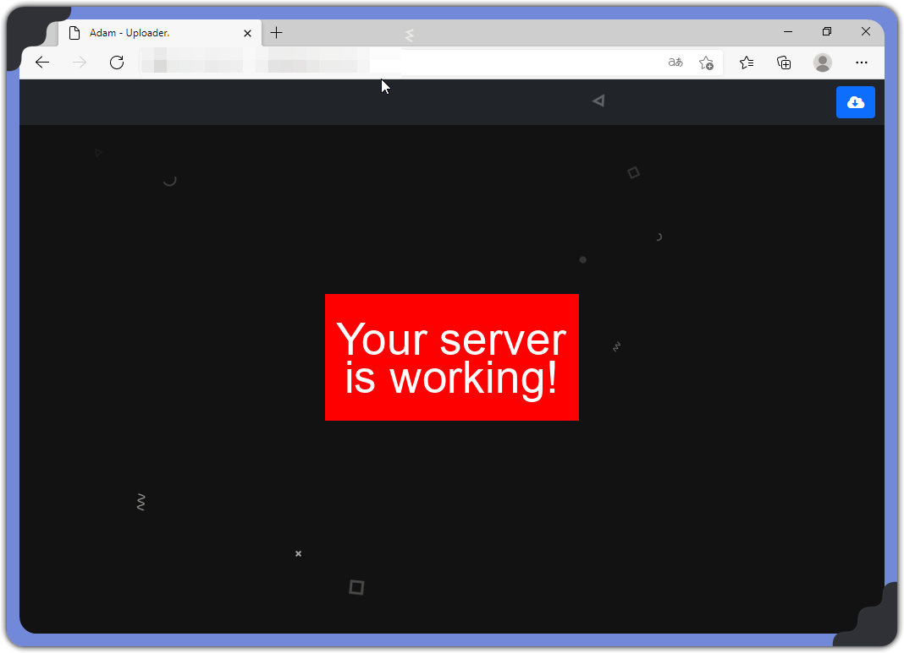
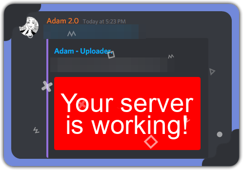

<!-- PROJECT LOGO -->
<br />
<p align="center">
  <h3 align="center">ImageUploader</h3>

  <p align="center">
    A simple image uploader website for use with screenshot applications such as ShareX.
    <br />
    <br />
    <a href="https://github.com/RealParrot/ImageUploader/issues">Report Bug</a>
    ·
    <a href="https://github.com/RealParrot/ImageUploader/issues">Request Feature</a>
  </p>
</p>

<!-- ABOUT THE PROJECT -->

## Examples





### Built With

- [Express](https://expressjs.com/)
- [EJS](https://ejs.co/)
- [Bootstrap](https://getbootstrap.com/)

<!-- GETTING STARTED -->

## Getting Started

To get a local copy up and running follow these simple steps.

### Installation

1. Clone the repo
   ```sh
   git clone https://github.com/RealParrot/ImageUploader.git
   ```
2. Install NPM packages
   ```sh
   npm install
   ```
3. Rename `.env.template` to `.env`
4. Configure your `.env` config following directions
5. Start the server
   ```sh
   npm start
   ```
6. ShareX Setup
   1. Edit `ImageHoster.sxcu` to include the key you set in `.env` and your domain.
   2. Open the file with ShareX and select "Yes" to use it as your image uploader.

<!-- LICENSE -->

## License

Distributed under the MIT License. See `LICENSE` for more information.

<!-- CONTACT -->

## Contact

Adam - Adam.#2004 on discord - contact@adamp.eu

Project Link: [https://github.com/RealParrot/ImageUploader](https://github.com/RealParrot/ImageUploader.git)

<!-- MARKDOWN LINKS & IMAGES -->
<!-- https://www.markdownguide.org/basic-syntax/#reference-style-links -->


